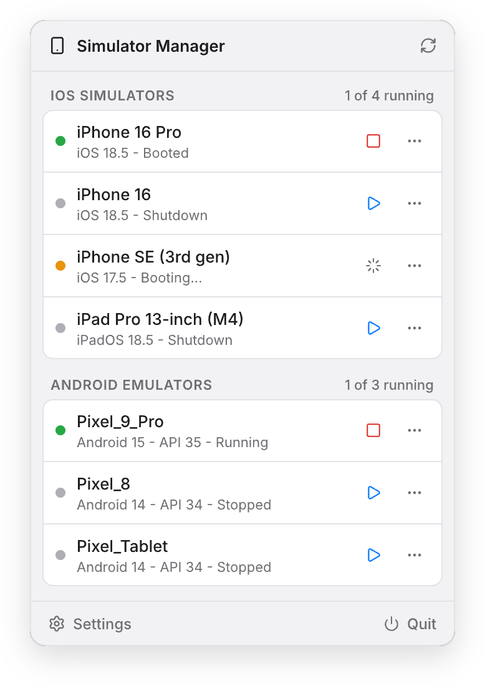
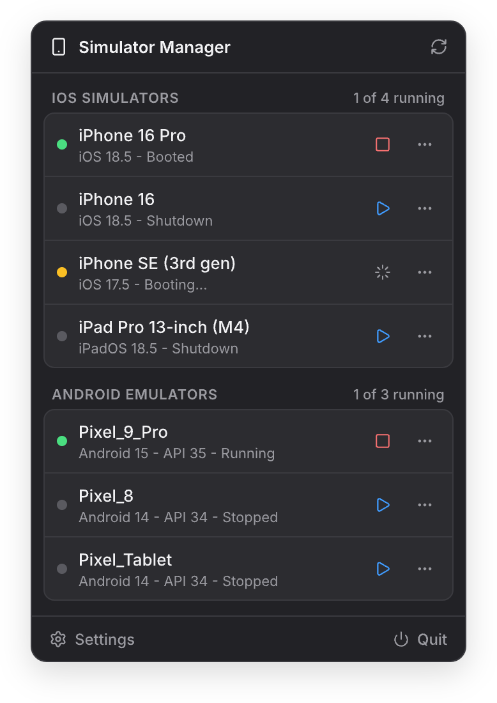

<p align="center">
  <h1 align="center">BootBar</h1>
  <p align="center">Boot, stop, and manage iOS Simulators and Android Emulators — from your macOS menu bar.</p>
</p>

<p align="center">
  <a href="https://github.com/dipendra-sharma/BootBar/actions/workflows/ci.yml"></a>
  
  
  
  <a href="https://github.com/dipendra-sharma/BootBar/releases/latest"></a>
</p>

## About

BootBar is a native SwiftUI menu bar app that puts your entire mobile device toolchain one click away. One panel for **both** Apple and Google toolchains — list, start, stop, cold-boot, and erase/wipe iOS Simulators and Android Emulators without touching Xcode, Android Studio, or a terminal.

No Electron, no daemons, no telemetry. A single lightweight panel driving `simctl`, `emulator`, and `adb` underneath.

## Features

- 🍎 **iOS Simulators** — list available devices with runtime version, boot (opens Simulator.app), shutdown, cold boot, erase content and settings
- 🤖 **Android Emulators** — list AVDs with API level, start, stop, cold boot (`-no-snapshot-load`), wipe data (`-wipe-data`)
- 🟢 **Live state tracking** — running / booting / stopped indicators refresh automatically while the panel is open
- 🧹 **Tidy by design** — quits Simulator.app automatically when the last simulator stops, so no orphan dock icons
- 🔍 **Android SDK auto-detection** — finds your SDK via `$ANDROID_HOME`, `$ANDROID_SDK_ROOT`, or the default install path, with a manual override in Settings
- 🪶 **Native and lightweight** — pure SwiftUI `MenuBarExtra`, zero third-party dependencies, no dock icon

## Preview

| Light | Dark |
| :---: | :---: |
|  |  |

## Installation

### Build from source

```bash
git clone https://github.com/dipendra-sharma/BootBar.git
cd BootBar
xcodebuild -project BootBar.xcodeproj -scheme BootBar -derivedDataPath build build
open "build/Build/Products/Debug/BootBar.app"
```

Or open `BootBar.xcodeproj` in Xcode and press Run.

Pre-built releases and a Homebrew cask are planned — watch the [Releases](https://github.com/dipendra-sharma/BootBar/releases) page.

## Requirements

- macOS 14 or later
- Xcode (for `xcrun simctl` — iOS section)
- Android SDK with `emulator` and `platform-tools` (Android section)

> [!IMPORTANT]
> Each platform section degrades independently. No Xcode? The iOS section shows a hint while Android keeps working — and vice versa. Neither toolchain is required for the app to launch.

## Usage

1. Click the phone icon in the menu bar
2. Press ▶ to boot a device, ■ to stop it
3. The ⋯ menu holds **Cold Boot** and **Erase / Wipe Data**
4. The panel auto-refreshes every 5 seconds while open
5. Set a custom Android SDK path via **Settings** in the footer

| Action | iOS | Android |
| --- | --- | --- |
| Start | `simctl boot` + opens Simulator.app | `emulator -avd` |
| Stop | `simctl shutdown` | `adb emu kill` |
| Cold Boot | shutdown → boot | restart with `-no-snapshot-load` |
| Erase / Wipe | `simctl erase` | restart with `-wipe-data` |

## Architecture

All device logic lives in `BootBarCore`, a local Swift package with full unit test coverage (parsers and services tested against real CLI output fixtures). The app target contains only SwiftUI views.

```bash
cd BootBarCore
swift test
```

## FAQ

**No iOS simulators listed?** Make sure Xcode is installed and `xcrun simctl list devices` works in a terminal.

**No Android emulators listed?** BootBar looks for the SDK at `$ANDROID_HOME`, `$ANDROID_SDK_ROOT`, then `~/Library/Android/sdk`. Set the path manually in Settings if yours lives elsewhere.

**A device stays "Booting…" for a while?** Android emulators take 30-60 s to register with `adb` after launch. The dot turns green as soon as the device reports in.

**Does it phone home?** No. BootBar makes zero network requests.

## Contributing

Contributions are welcome — see [CONTRIBUTING.md](CONTRIBUTING.md). Please use the issue templates for bugs and feature requests.

## Acknowledgements

[MiniSim](https://github.com/okwasniewski/MiniSim) and [Control Room](https://github.com/twostraws/ControlRoom) explored this space first and remain excellent tools.

## License

[MIT](LICENSE) © Dipendra Sharma
